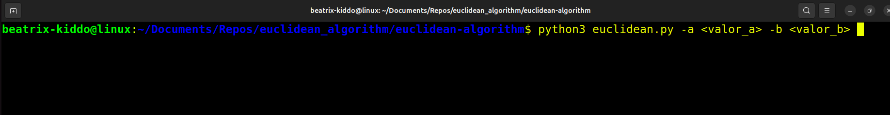

# Algoritmo de Euclides

Este script calcula el Máximo Común Divisor (MCD) de dos números utilizando el Algoritmo de Euclides y también expresa el **MCD(A,B) = AX + BY**.

## Uso:


## Ejemplo de ejecucion con A = 40 B = 20


## Requisitos

Antes de ejecutar el script, asegúrate de instalar las dependencias necesarias. Puedes hacerlo utilizando el archivo `requirements.txt`:

```bash
pip install -r requirements.txt
